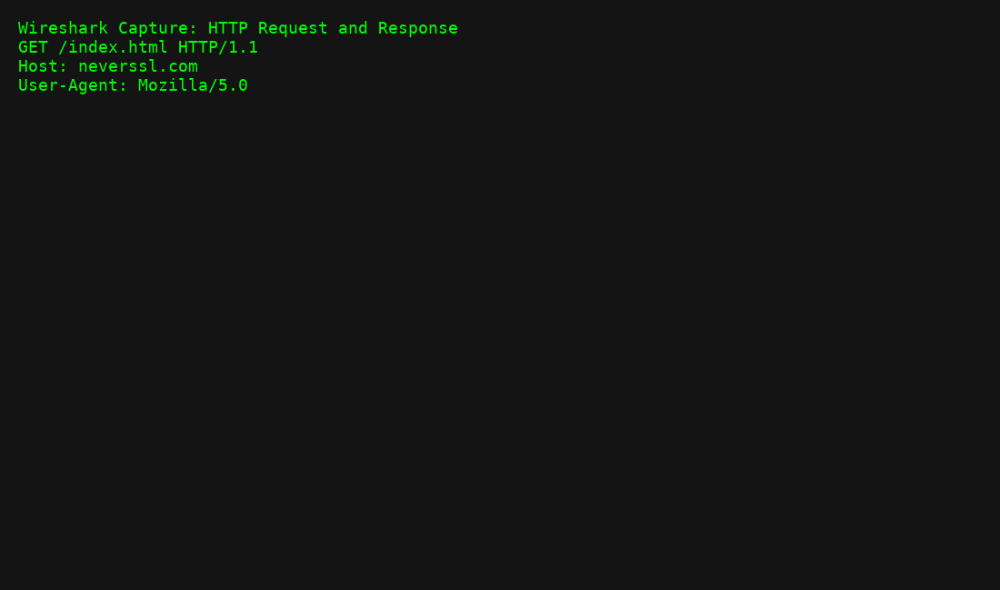

[README.md](https://github.com/user-attachments/files/21673757/README.md)
# Wireshark Traffic Analysis Lab

This lab demonstrates capturing and analyzing HTTP and DNS traffic using **Wireshark**.

## Steps
1. Capture traffic on the main network interface.
2. Filter HTTP traffic using `http`.
3. Filter DNS queries using `dns`.

## Sample Output

## Lessons Learned
- HTTP traffic is unencrypted and can reveal sensitive information.
- DNS logs can reveal suspicious or malicious domains.
